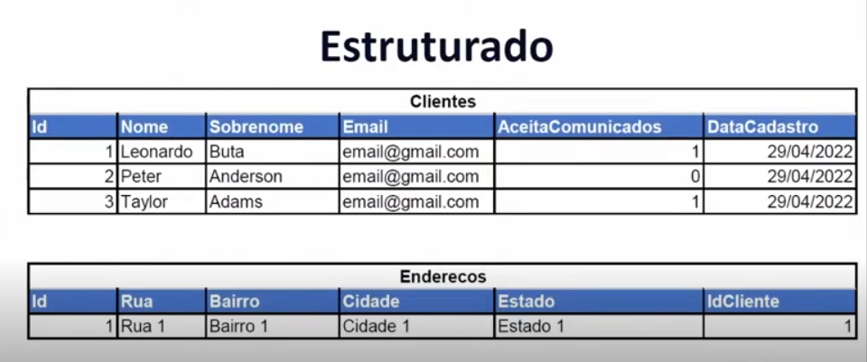

# Banco de Dados

Um ***banco de dados*** é uma coleção de informações estruturadas. Informações essas que podemos são armazenadas em um banco para manipulação ou consulta, existe diversos tipos de bancos de dados e seu uso varia de acordo com a necessidade e disponibilização de recursos.  
- ***Banco de Dados Relacional***: Banco que armazena dados estruturados, os dados são organizados em tabelas, com colunas e linhas. E essa tabelas podem se relacionar entre si através de um campo de uma tabela A que faz referencia à informação primaria de uma tabela B.  

- ***Banco de Dados Não Relacional***: Também serve para armazenar dados, porém as informações são armazenadas de maneira não estruturadas, ou semiestruturadas, Dados em que há uma estrutura não rígida, podendo ter informações variados.  

## Sistema de Gerenciamento de Bando de Dados (SGBD)

Em inglês conhecidos como ***Databases Management System (DBMS)***, os ***Sistemas de Gerenciamento de Banco de Dados (SGBD)*** são sistemas utilizados para manipular e monitorar um Banco de Dados

